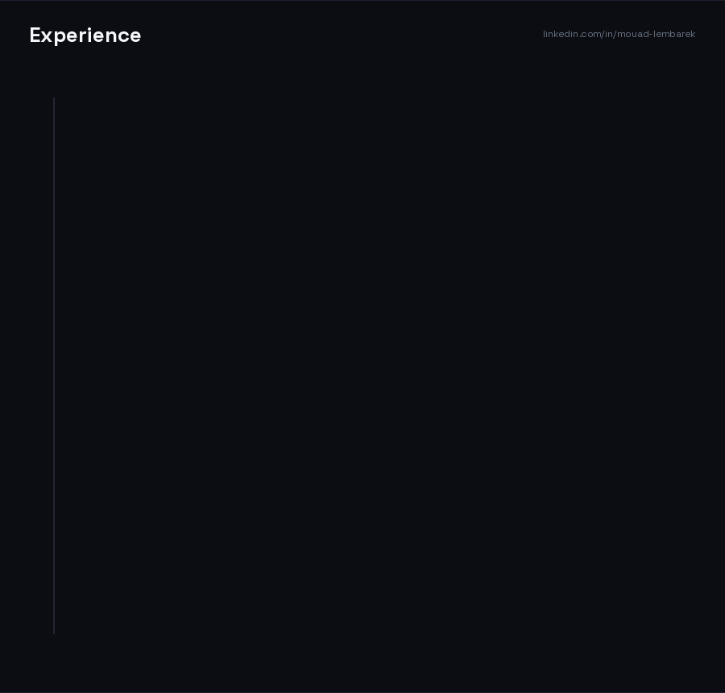
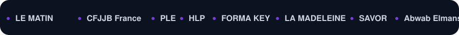

 

## About

I'm an AI & Software Engineer, Engineering Team Manager, focused on building intelligent systems, automation, and software products. I'm also an **n8n Ambassador & GDG Organiser**, passionate about AI, automation, and sharing knowledge with the developer community.

My approach: **understand the problem → simplify it → build the solution → deliver value to my clients**

 

## Experience in numbers

Experience spans AI, software engineering, automation, data, and computer science — across different technologies, industries, architectures, and problem domains.

 
 

## Currently

- **Engineering Team Manager @ Cylindrique** — leading and mentoring development work on software and AI-related products
- Final-year **AI & Data Engineering** student at **ENSIASD** (École Nationale Supérieure de l'Intelligence Artificielle et Sciences des Données)
- **n8n Ambassador** & **GDG (Google for Developers) Organiser** — automation, AI agents, and workflow engineering
- Working on many projects across AI, software engineering, and automation
- Open to **internships, research collaborations, and full-time AI/software roles**

 

## Community

Leading in the AI and developer ecosystem through **GDG**, **n8n**, **Codex**, and **Cursor** — organizing meetups and hackathons, and sharing knowledge with the community.

 

## Education

 

## Where I focus

 

## Tech stack

  

 

## Business work

15 real client products delivered from scratch — from software engineering to AI agents and automation.

 

## Combined GitHub activity

I build across two accounts — **Mouad-Lembarek** (main) and **Mouad-Cylindrique** (Cylindrique / professional work). The calendar below merges the daily contribution counts from both into a single graph:

 

## Connect with me :)

